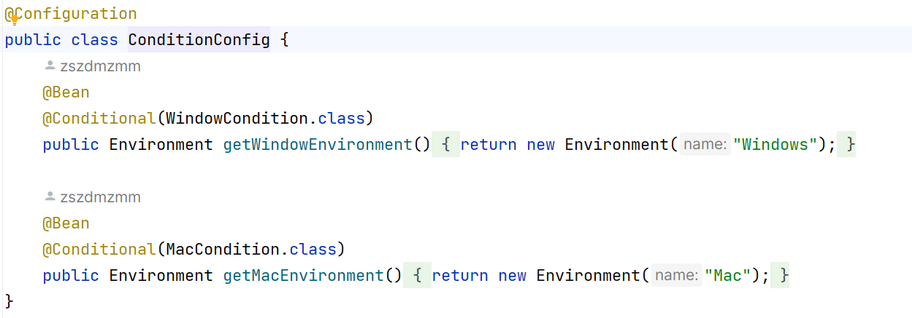
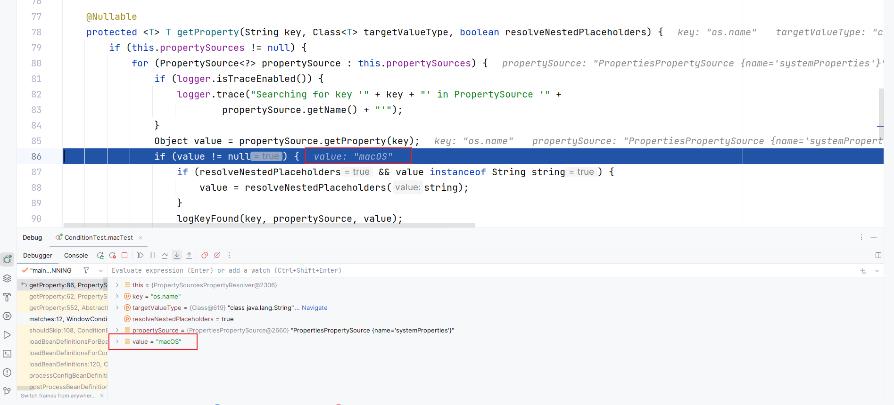

### 探索源代码的一次尝试
#### 引论

有这样一个Config类：

其有一个Bean包含一个Condition类：

在@Test方法中我改变了System的Property os.name的值，伪造了身份，得以通过Condition的验证：

因为@Test测试方法通过，则Condition类中context.getEnvironment().getProperty()一定调用了System.getProperty()。
以下是通过探索源代码来确认这点的过程。

#### 溯源的过程

1. 因为我们必须通过os.name这个key获取value，我们需要紧跟这个key，寻找何时获得了值。
    1. 步骤1：

       
    2. 步骤2：

       
    3. 步骤3：

       
    4. 步骤4：此时发现value的值已经被附上了，则这个值就在propertySource里。

       
    5. 步骤5：来到了一个构造函数，此时来到了关键步骤，溯源过程来到这可能到达瓶颈，此时应跳出思维定势，思考是谁通过构造函数把值赋给了这个属性：谁调用了这个构造函数，谁赋给了propertySource我们想要的值。

       
    6. 步骤6：自然是调用了它的context.getEnvironment()。

       
    7. 步骤7：

       
    8. 步骤8：

       
    9. 步骤9：此时又来到构造函数，这次明确是了赋值的方法。

       
    10. 步骤10：

        
    11. 步骤11：再一次来到了构造函数，这次没有属性被赋值，但是属性有其初始值，我们看到了疑似我们想要的字眼。

        
    12. 步骤12：往下翻，我们看到了这个方法：

        
    13. 步骤13：

        
    14. 步骤14：至此，我们找到了源头。

        

2. 为了验证这一点，我们可以通过debug打个断点，判断程序是否真的经过这里，答案显而易见：  

   
3. 为什么不直接使用这个办法呢，因为在尚未知道答案前，如果我们没有猜测，是无法把断点打在这么深的地方的，但我们仍然有办法通过debug来辅助我们获得结论。
    1. 通过将断点打在这个入口位置，就可以跟随debug溯源：  

       
    2. 最终到达此处时，值已经被赋予：  

       
    3. 通过前面的思路，我们又可以回到getEnvironment()里去。
    4. 而在溯源至接口时也可以通过断点判断代码经过的究竟是哪个实现类，提高溯源效率。
4. 总上文所述：经过了溯源，我们发现Condition类实际上是通过System.getProperties()
   来获取机器的环境信息。为我们通过System.setProperty()来伪造身份的方法提供了理论支撑。