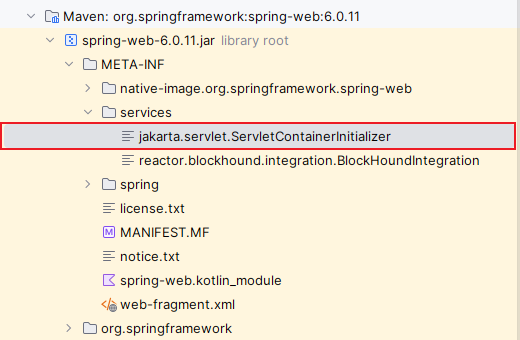

### SSM的基本原理

#### 什么是SSM

SSM的三个字母分别是Spring，SpringMVC和Mybatis，SSM就是把这三个框架整合起来。

#### SSM整合的过程与原理

1. 正如电脑打开时，主板的bios系统率先自启，一系列检测结束后开启硬盘上的系统-windows一样，servlet
   container在启动时也会通过一些规范执行一些默认程序，在SSM中，他会找到这个文件：

   

   执行文件中的类：

     

   并调用其中的onStartup方法：  

   

   排除去各种判断语句，留下了红框中的代码，逻辑是扫描了所有实现了WebApplicationInitializer的类，并且执行其onStartup方法，因此实现SSM的必要一步呼之欲出，即写一个最终实现WebApplicationInitializer接口的类。

2. 以下是一个AbstractAnnotationConfigDispatcherServletInitializer.class的继承类，其最终实现了WebApplicationInitializer接口：
   
   
   如下所示：
   
   
   可以知道，服务器最终执行了一个onStartup方法，并找到重写的三个方法起了什么作用。要找到onStartup方法，可以利用ideal提供的功能迅速定位：

   

   在顺着onStartup方法，找到了getServletMapping方法：

   

   另外两个方法可以在这里找到：

   

   此时完成了spring与spring-mvc的整合，在服务器开启时，spring容器被自动的new出来，spring里应有的bean被注入，Mybatis也在这个阶段被整合进来。

